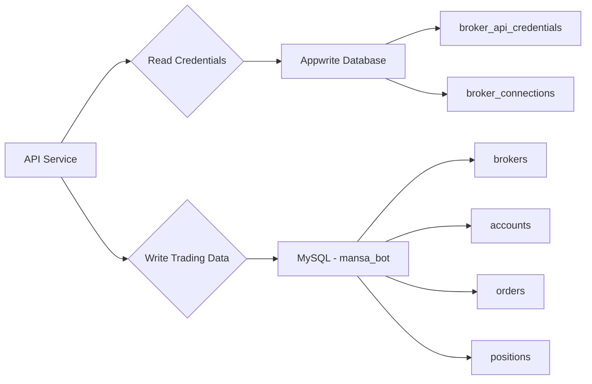

# Unified Broker Schema - Integration Guide

## Overview

The Unified Broker Schema provides a normalized, multi-tenant database structure for managing trading operations across multiple brokers in the Bentley Budget Bot ecosystem.

---

## 🏗️ Architecture

### Database Location
- **Development:** MySQL Port 3307, Database: `mansa_bot`
- **Production:** Railway MySQL (nozomi.proxy.rlwy.net:54537)
- **Schema File:** `bentleybot/sql/#MySQL for UNIFIED BROKER Schema.sql`

### Data Storage Split

| Component | Storage | Purpose |
|-----------|---------|---------|
| **MySQL** | Operational Data | Orders, positions, accounts, executions |
| **Appwrite** | Configuration Data | API credentials, connection settings |

---

## 📊 Schema Design

### Core Tables

#### 1. **brokers**
Stores broker metadata and configuration
```sql
- id (PK)
- name (UNIQUE) - 'alpaca', 'ibkr', 'mt5', 'binance', 'schwab', 'tradestation'
- display_name - 'Interactive Brokers', 'Charles Schwab'
- type - 'equities', 'forex', 'crypto', 'futures', 'options'
- api_base_url
- is_active (BOOLEAN)
- created_at, updated_at
```

**Supported Brokers:**
- ✅ Alpaca (Equities)
- ✅ Interactive Brokers (Equities/Options)
- ✅ Charles Schwab (Equities)
- ✅ Binance (Crypto)
- ✅ TradeStation (Equities/Futures)
- ✅ MetaTrader 5 (Forex/Commodities)

#### 2. **accounts** (Multi-Tenant)
Broker accounts with ownership tracking
```sql
- id (PK)
- broker_id (FK → brokers)
- account_api_id (Broker-specific ID)
- account_number
- owner - 'Mansa Capital Partners', 'Moor Capital Trust', 'Personal'
- owner_type - 'corporate', 'trust', 'personal', 'joint'
- balance, buying_power, cash, portfolio_value
- currency
- status - 'active', 'inactive', 'restricted', 'closed'
- is_pattern_day_trader
- created_at, updated_at
```

**Multi-Tenant Support:**
- **Mansa Capital Partners** (Corporate entity)
- **Moor Capital Trust** (Trust account)
- **Personal** (Individual accounts)

#### 3. **positions**
Current holdings across all brokers
```sql
- id (PK)
- broker_id (FK → brokers)
- account_id (FK → accounts)
- symbol (e.g., 'AAPL', 'BTC/USD', 'EURUSD')
- asset_type - 'stock', 'crypto', 'forex', 'option', 'future'
- qty (DECIMAL 18,6 for crypto precision)
- avg_entry_price, current_price
- market_value, cost_basis
- unrealized_pnl, unrealized_pnl_pct
- realized_pnl
- side - 'long', 'short'
- position_api_id
- last_synced_at
- created_at, updated_at
```

#### 4. **orders**
Order lifecycle tracking
```sql
- id (PK)
- broker_id (FK → brokers)
- account_id (FK → accounts)
- order_api_id (Broker-specific order ID)
- client_order_id (Client-assigned tracking ID)
- symbol, asset_type
- qty, filled_qty
- side - 'buy', 'sell'
- order_type - 'market', 'limit', 'stop', 'stop_limit', 'trailing_stop'
- time_in_force - 'day', 'gtc', 'ioc', 'fok'
- limit_price, stop_price, avg_fill_price
- status - 'pending', 'new', 'partially_filled', 'filled', 'cancelled', 'rejected', 'expired'
- submitted_at, filled_at, cancelled_at, expired_at
- strategy_id (extensibility for future strategies table)
- notes
- created_at, updated_at
```

#### 5. **order_executions**
Individual fill details
```sql
- id (PK)
- order_id (FK → orders)
- execution_api_id (Broker-specific execution ID)
- qty, price
- commission, fees
- liquidity_flag - 'maker', 'taker', 'unknown'
- executed_at
- created_at
```

---

## 🔐 Railway Deployment

### Current Railway Configuration
```env
RAILWAY_MYSQL_HOST=nozomi.proxy.rlwy.net
RAILWAY_MYSQL_PORT=54537
RAILWAY_MYSQL_USER=root
RAILWAY_MYSQL_PASSWORD=<from_railway_dashboard>
```

### Deployment Steps

#### 1. Deploy Schema to Railway
```bash
# Using Railway CLI
railway connect

# Import schema
mysql -h nozomi.proxy.rlwy.net \
      -P 54537 \
      -u root \
      -p \
      mansa_bot < bentleybot/sql/#MySQL\ for\ UNIFIED\ BROKER\ Schema.sql
```

#### 2. Verify Tables Created
```bash
railway run python -c "
import mysql.connector
import os
conn = mysql.connector.connect(
    host=os.getenv('RAILWAY_MYSQL_HOST'),
    port=int(os.getenv('RAILWAY_MYSQL_PORT')),
    user=os.getenv('RAILWAY_MYSQL_USER'),
    password=os.getenv('RAILWAY_MYSQL_PASSWORD'),
    database='mansa_bot'
)
cursor = conn.cursor()
cursor.execute('SHOW TABLES LIKE \"brokers\"')
print('Brokers table exists:', cursor.fetchone() is not None)
"
```

#### 3. Seed Initial Broker Data
```sql
-- Run on Railway MySQL
INSERT INTO brokers (name, display_name, type, api_base_url) VALUES
    ('alpaca', 'Alpaca Markets', 'equities', 'https://paper-api.alpaca.markets'),
    ('ibkr', 'Interactive Brokers', 'equities', 'https://api.ibkr.com'),
    ('schwab', 'Charles Schwab', 'equities', 'https://api.schwab.com'),
    ('binance', 'Binance', 'crypto', 'https://api.binance.com'),
    ('tradestation', 'TradeStation', 'equities', 'https://api.tradestation.com'),
    ('mt5', 'MetaTrader 5', 'forex', 'http://localhost:8000')
ON DUPLICATE KEY UPDATE
    display_name = VALUES(display_name),
    api_base_url = VALUES(api_base_url),
    updated_at = CURRENT_TIMESTAMP;
```

---

## 🔌 Appwrite Integration

### Appwrite Database Configuration
```json
{
  "projectId": "68869ef500017ca73772",
  "databaseId": "694481eb003c0a14151d",
  "databaseName": "Bentley_Mansa"
}
```

### Appwrite Collections (Already Exist)

#### broker_api_credentials
Stores encrypted API keys and secrets
```javascript
{
  broker_name: String,        // Matches brokers.name in MySQL
  api_key: String,            // Encrypted
  api_secret: String,         // Encrypted
  api_endpoint: String,
  environment: String,        // 'production', 'sandbox'
  is_active: Boolean,
  user_id: String,            // Appwrite user ID
  created_at: Timestamp,
  updated_at: Timestamp
}
```

#### broker_connections
Tracks active broker connections
```javascript
{
  broker_name: String,        // Matches brokers.name in MySQL
  user_id: String,
  status: String,             // 'connected', 'disconnected', 'error'
  last_connected: Timestamp,
  error_message: String,
  connection_metadata: Object // Additional connection info
}
```

### Integration Pattern



### Example Python Integration
```python
from appwrite.client import Client
from appwrite.services.databases import Databases
import mysql.connector
import os

# Initialize Appwrite
client = Client()
client.set_endpoint('https://fra.cloud.appwrite.io/v1')
client.set_project('68869ef500017ca73772')
client.set_key(os.getenv('APPWRITE_API_KEY'))

databases = Databases(client)

# Get broker credentials from Appwrite
def get_broker_credentials(broker_name):
    result = databases.list_documents(
        database_id='694481eb003c0a14151d',
        collection_id='broker_api_credentials',
        queries=[f'broker_name={broker_name}']
    )
    return result['documents'][0] if result['documents'] else None

# Connect to MySQL for trading operations
mysql_conn = mysql.connector.connect(
    host=os.getenv('RAILWAY_MYSQL_HOST'),
    port=int(os.getenv('RAILWAY_MYSQL_PORT')),
    user=os.getenv('RAILWAY_MYSQL_USER'),
    password=os.getenv('RAILWAY_MYSQL_PASSWORD'),
    database='mansa_bot'
)

# Example: Place order workflow
def place_order(broker_name, account_id, symbol, qty, side):
    # 1. Get credentials from Appwrite
    creds = get_broker_credentials(broker_name)
    
    # 2. Submit order to broker API using credentials
    # ... broker API call ...
    
    # 3. Store order in MySQL
    cursor = mysql_conn.cursor()
    cursor.execute("""
        INSERT INTO orders (broker_id, account_id, order_api_id, symbol, qty, side, status)
        SELECT b.id, %s, %s, %s, %s, %s, 'pending'
        FROM brokers b WHERE b.name = %s
    """, (account_id, order_api_id, symbol, qty, side, broker_name))
    mysql_conn.commit()
```

---

## 🎯 Key Features

### 1. Normalization
Each broker's API identifiers are stored for reconciliation:
- `account_api_id` - Broker-specific account number
- `order_api_id` - Broker-specific order ID
- `position_api_id` - Broker-specific position ID
- `execution_api_id` - Broker-specific execution/trade ID

### 2. Multi-Tenant Support
The `owner` and `owner_type` fields in `accounts` table enable tracking:
- **Mansa Capital Partners** (Corporate)
- **Moor Capital Trust** (Trust)
- **Personal Accounts** (Individual)

Query accounts by owner:
```sql
SELECT a.*, b.name AS broker
FROM accounts a
JOIN brokers b ON a.broker_id = b.id
WHERE a.owner = 'Mansa Capital Partners';
```

### 3. Auditability
All tables include:
- `created_at` - Record creation timestamp
- `updated_at` - Last modification timestamp (auto-updated)
- Additional lifecycle timestamps (e.g., `submitted_at`, `filled_at`, `cancelled_at` in orders)

### 4. Extensibility
Placeholder fields and design patterns for future tables:
- `strategy_id` in orders table (links to future `trading_strategies`)
- Separate `order_executions` table (supports complex order fills)
- `notes` fields for contextual information
- `status_message` for detailed error tracking

**Future Extensions Planned:**
- `transactions` - General ledger
- `trading_strategies` - Strategy definitions
- `strategy_signals` - Signal generation log
- `risk_limits` - Risk management rules
- `performance_metrics` - Daily/monthly tracking
- `audit_log` - User action trail

---

## 🔄 Data Sync Strategy

### Broker → MySQL Sync
```python
# Example sync job for positions
def sync_positions_from_alpaca(account_id):
    # 1. Get credentials
    creds = get_broker_credentials('alpaca')
    
    # 2. Fetch positions from Alpaca API
    alpaca_positions = fetch_alpaca_positions(creds)
    
    # 3. Update MySQL
    for pos in alpaca_positions:
        cursor.execute("""
            INSERT INTO positions 
            (broker_id, account_id, symbol, qty, avg_entry_price, current_price, 
             market_value, unrealized_pnl, position_api_id, last_synced_at)
            SELECT b.id, %s, %s, %s, %s, %s, %s, %s, %s, NOW()
            FROM brokers b WHERE b.name = 'alpaca'
            ON DUPLICATE KEY UPDATE
                qty = VALUES(qty),
                current_price = VALUES(current_price),
                market_value = VALUES(market_value),
                unrealized_pnl = VALUES(unrealized_pnl),
                last_synced_at = NOW()
        """, (account_id, pos.symbol, pos.qty, pos.avg_price, 
              pos.current_price, pos.market_value, pos.unrealized_pnl, pos.id))
```

### Scheduled Sync Jobs
- **Positions:** Every 5 minutes during market hours
- **Orders:** Real-time via webhooks + 1-minute polling
- **Account Balances:** Every 15 minutes
- **Executions:** Real-time via webhooks

---

## 📈 Usage Examples

### Create Account
```sql
-- Mansa Capital account with Alpaca
INSERT INTO accounts (broker_id, account_api_id, account_number, owner, owner_type, balance)
SELECT id, 'ALPACA123456', 'MCP-001', 'Mansa Capital Partners', 'corporate', 100000.00
FROM brokers WHERE name = 'alpaca';
```

### Place Order
```sql
-- Buy 100 shares of AAPL for Mansa Capital
INSERT INTO orders (broker_id, account_id, order_api_id, client_order_id, 
                    symbol, qty, side, order_type, time_in_force, status)
SELECT b.id, a.id, 'ALP-ORD-123', 'MCP-AAPL-001', 'AAPL', 100, 'buy', 
       'market', 'day', 'pending'
FROM brokers b
JOIN accounts a ON b.id = a.broker_id
WHERE b.name = 'alpaca' AND a.owner = 'Mansa Capital Partners';
```

### Query Positions by Owner
```sql
-- All positions for Mansa Capital
SELECT 
    b.display_name AS broker,
    a.account_number,
    p.symbol,
    p.qty,
    p.market_value,
    p.unrealized_pnl,
    ROUND(p.unrealized_pnl_pct, 2) AS pnl_pct
FROM positions p
JOIN accounts a ON p.account_id = a.id
JOIN brokers b ON p.broker_id = b.id
WHERE a.owner = 'Mansa Capital Partners' 
  AND p.qty != 0
ORDER BY p.unrealized_pnl DESC;
```

### Order Performance by Broker
```sql
-- Order fill statistics by broker
SELECT 
    b.display_name,
    COUNT(*) AS total_orders,
    SUM(CASE WHEN o.status = 'filled' THEN 1 ELSE 0 END) AS filled,
    ROUND(AVG(TIMESTAMPDIFF(SECOND, o.submitted_at, o.filled_at)), 2) AS avg_fill_time_sec
FROM orders o
JOIN brokers b ON o.broker_id = b.id
WHERE o.submitted_at >= DATE_SUB(NOW(), INTERVAL 7 DAY)
GROUP BY b.id, b.display_name;
```

---

## 🛠️ Maintenance

### Index Optimization
Key indexes already defined:
- `accounts.unique_broker_account` - Prevents duplicate accounts
- `positions.unique_position` - Ensures one position per symbol/side
- `orders.unique_order` - Prevents duplicate order entries
- Performance indexes on frequently queried columns

### Backup Strategy
```bash
# Daily backup of broker data
mysqldump -h nozomi.proxy.rlwy.net -P 54537 -u root -p \
  --databases mansa_bot \
  --tables brokers accounts positions orders order_executions \
  > backup_brokers_$(date +%Y%m%d).sql
```

### Monitoring Queries
```sql
-- Check sync freshness
SELECT 
    b.name,
    COUNT(*) AS positions,
    MAX(p.last_synced_at) AS last_sync
FROM positions p
JOIN brokers b ON p.broker_id = b.id
GROUP BY b.id, b.name;

-- Identify stale positions (not synced in 10 minutes)
SELECT * FROM positions
WHERE last_synced_at < DATE_SUB(NOW(), INTERVAL 10 MINUTE);
```

---

## 📚 References

- **Schema File:** [bentleybot/sql/#MySQL for UNIFIED BROKER Schema.sql](c:\Users\winst\BentleyBudgetBot\bentleybot\sql\#MySQL for UNIFIED BROKER Schema.sql)
- **Appwrite Config:** [appwrite.json](c:\Users\winst\BentleyBudgetBot\appwrite.json)
- **Railway Docs:** https://docs.railway.app/
- **MySQL Consolidation:** [MYSQL_CONSOLIDATION_REPORT.md](c:\Users\winst\BentleyBudgetBot\MYSQL_CONSOLIDATION_REPORT.md)

---

**Last Updated:** January 12, 2026  
**Schema Version:** 1.0  
**Status:** ✅ Production Ready
